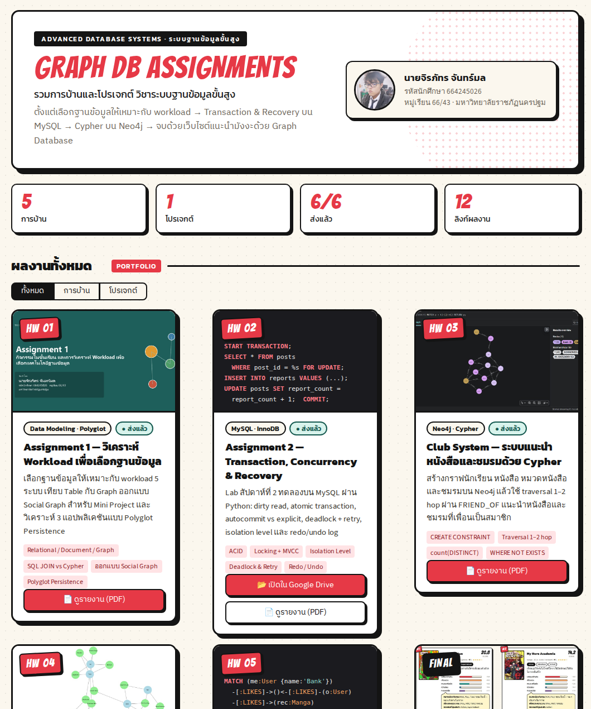

# 🕸️ Graph DB Assignments — รวมการบ้านวิชาระบบฐานข้อมูลขั้นสูง

**นายจิรภัทร จันทร์มล** · รหัสนักศึกษา 664245026 · หมู่เรียน 66/43 · มหาวิทยาลัยราชภัฏนครปฐม

🌐 **เว็บรวมการบ้าน:** https://graphdb-664245026.streamlit.app

| # | งาน | เทคโนโลยี | ลิงก์ |
|---|---|---|---|
| HW 01 | Assignment 1 — วิเคราะห์ Workload เพื่อเลือกฐานข้อมูล | Data Modeling · Polyglot | [รายงาน PDF](reports/Assignment1_664245026.pdf) |
| HW 02 | Assignment 2 — Transaction, Concurrency & Recovery | MySQL · InnoDB | [Google Drive](https://drive.google.com/file/d/1-LYLigMgURWqnDd925X0xamGXVh8Tuh6/view?usp=sharing) · [รายงาน PDF](reports/Assignment2_664245026.pdf) |
| HW 03 | Club System — ระบบแนะนำหนังสือและชมรมด้วย Cypher | Neo4j · Cypher | [รายงาน PDF](reports/664245026_Club_System.pdf) |
| HW 04 | Manga Recommender ด้วย NetworkX | Python · NetworkX | [โน้ตบุ๊ก](https://github.com/SuzakuKung4826/MangaGraph/blob/main/homework/HW1_Manga_Recommender_NetworkX.ipynb) · [Colab](https://colab.research.google.com/github/SuzakuKung4826/MangaGraph/blob/main/homework/HW1_Manga_Recommender_NetworkX.ipynb) |
| HW 05 | Manga Recommender ด้วย Neo4j Aura | Neo4j · Cypher | [โน้ตบุ๊ก](https://github.com/SuzakuKung4826/MangaGraph/blob/main/homework/HW2_Manga_Recommender_Neo4j.ipynb) · [Colab](https://colab.research.google.com/github/SuzakuKung4826/MangaGraph/blob/main/homework/HW2_Manga_Recommender_Neo4j.ipynb) |
| FINAL | MangaGraph — เว็บแนะนำมังงะด้วย Graph Database | Streamlit · Neo4j Aura | [เว็บระบบ](https://mangagraph-664245026.streamlit.app) · [PowerPoint](https://github.com/SuzakuKung4826/MangaGraph/blob/main/slides/MangaGraph_Presentation.pptx) · [Source code](https://github.com/SuzakuKung4826/MangaGraph) · [หน้าสรุป](https://suzakukung4826.github.io/MangaGraph/) |



## เพิ่มการบ้านชิ้นใหม่

เปิด `app.py` แล้วเพิ่ม dict ใหม่ในลิสต์ `ASSIGNMENTS` (ใส่รูปไว้ใน `assets/`) จากนั้นเพิ่มแถวในตารางด้านบนแล้ว push ขึ้น GitHub
Streamlit Cloud จะอัปเดตเว็บให้อัตโนมัติ

## รันในเครื่อง

```bash
pip install -r requirements.txt
streamlit run app.py
```
